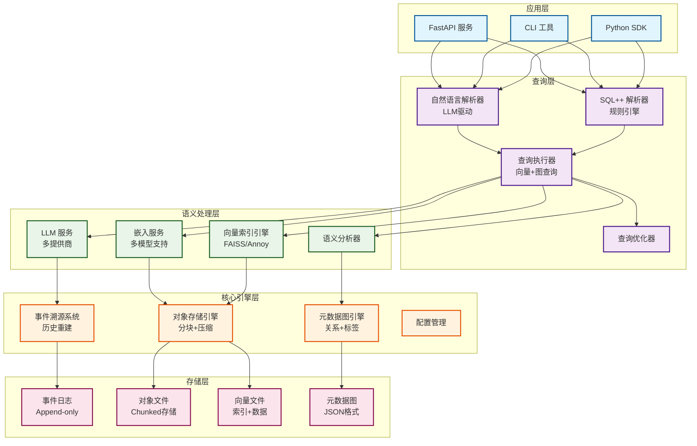

# SemanticCoreDB - 基于 LLM 的语义驱动数据库

## 项目概述

SemanticCoreDB 是一个革命性的数据库系统，采用**事件化对象存储 + 向量索引 + 元数据图结构**的组合架构，原生支持语义索引与推理。系统摒弃传统存储引擎和文件格式，为智能应用提供一体化存储与查询平台。

## 🚀 核心特性

### 语义优先架构
- **自然语言查询**：支持中文自然语言查询，基于 LLM 理解用户意图
- **语义向量索引**：集成 FAISS、Annoy 等向量索引，支持高维语义搜索
- **多模态统一存储**：文本、图像、视频、音频、IoT 数据统一管理
- **智能语义匹配**：基于内容相似性的智能压缩和检索

### 事件溯源系统
- **完整事件流**：所有数据变更记录为不可变事件，支持精确历史重建
- **时间旅行**：支持任意时间点的状态重建和回滚
- **快照机制**：定期创建状态快照，加速历史状态重建
- **并发控制**：乐观锁和冲突解决机制

### 存储引擎创新
- **Chunked Object Store**：大对象自动分块，支持流式读写
- **Merkle DAG**：内容寻址存储，支持去重和完整性验证
- **语义压缩**：基于内容相似性的智能压缩算法
- **分层存储**：智能冷热数据分层管理

### 元数据图引擎
- **关系建模**：支持复杂对象关系建模和查询
- **标签索引**：高效的标签和类型索引系统
- **时间索引**：基于时间范围的高效查询
- **图遍历**：支持深度关系查询和路径分析

## 🏗️ 系统架构



### 架构说明

**应用层**：提供多种访问接口，包括 RESTful API、命令行工具和 Python SDK

**查询层**：支持自然语言和 SQL++ 两种查询方式，LLM 驱动的智能解析

**语义处理层**：负责向量化、语义分析和 LLM 推理，支持多种模型和提供商

**核心引擎层**：事件溯源、元数据图和对象存储三大核心引擎

**存储层**：分层存储设计，支持事件日志、对象文件和向量数据的持久化

## 📁 项目结构

```
SemanticCoreDB/
├── src/                          # 源代码
│   ├── core/                     # 核心引擎
│   │   ├── database.py          # 主数据库类
│   │   ├── config.py            # 配置管理
│   │   ├── event_sourcing.py    # 事件溯源系统
│   │   ├── event_store.py       # 事件存储
│   │   └── metadata_graph.py    # 元数据图引擎
│   ├── storage/                  # 存储层
│   │   ├── object_store.py      # 基础对象存储
│   │   └── chunked_object_store.py # 分块对象存储
│   ├── semantic/                 # 语义处理
│   │   ├── vector_index.py      # 向量索引引擎
│   │   ├── embedding_service.py # 嵌入服务
│   │   ├── llm_service.py       # LLM 服务
│   │   ├── llm_factory.py       # LLM 工厂
│   │   └── custom_vector_engine.py # 自定义向量引擎
│   ├── query/                    # 查询层
│   │   ├── parser.py            # SQL++ 解析器
│   │   ├── natural_language_parser.py # 自然语言解析器
│   │   └── executor.py          # 查询执行器
│   └── api/                      # API 接口
│       └── main.py              # FastAPI 应用
├── config/                       # 配置文件
│   └── default.yaml             # 默认配置
├── examples/                     # 示例代码
│   └── basic_usage.py           # 基本使用示例
├── tests/                        # 测试代码
├── docs/                         # 技术文档
│   └── whitepaper/              # 技术白皮书
├── scripts/                      # 部署脚本
├── data/                         # 数据目录
└── requirements.txt              # Python 依赖
```

## 🛠️ 技术栈

### 核心依赖
- **Python 3.9+**：主要开发语言
- **FastAPI**：现代 Web API 框架
- **NumPy/SciPy**：科学计算和向量处理
- **NetworkX**：图数据结构和算法

### 向量索引
- **FAISS**：Facebook AI 相似性搜索
- **Annoy**：Spotify 近似最近邻搜索
- **自定义引擎**：Windows 兼容的向量搜索

### 机器学习
- **Transformers**：预训练模型支持
- **Sentence-Transformers**：文本嵌入
- **PyTorch**：深度学习框架

### 多模态处理
- **Pillow/OpenCV**：图像处理
- **Librosa**：音频处理
- **MoviePy**：视频处理

### LLM 集成
- **OpenAI GPT**：GPT-3.5/4 支持
- **Anthropic Claude**：Claude 3 支持
- **本地模型**：Ollama 等本地部署

## 🚀 快速开始

### 环境要求

- Python 3.9+
- 8GB+ RAM（推荐 16GB+）
- 支持向量计算的 CPU 或 GPU

### 安装

```bash
# 克隆项目
git clone <repository-url>
cd SemanticCoreDB

# 创建虚拟环境
python -m venv venv
source venv/bin/activate  # Linux/Mac
# 或
venv\Scripts\activate     # Windows

# 安装依赖
pip install -r requirements.txt

# 配置环境变量
cp .env.example .env
# 编辑 .env 文件，配置 LLM API 密钥
```

### 基本使用

```python
import asyncio
from src.core.database import SemanticCoreDB
from src.core.config import Config

async def main():
    # 初始化数据库
    config = Config()
    db = SemanticCoreDB(config)
    
    # 插入文本数据
    text_data = {
        "type": "text",
        "data": "这是一篇关于人工智能的文章",
        "metadata": {
            "title": "AI 简介",
            "author": "张三",
            "category": "技术"
        },
        "tags": ["AI", "机器学习"]
    }
    
    text_id = await db.insert(text_data)
    print(f"插入成功，ID: {text_id}")
    
    # 自然语言查询
    results = await db.query("找出所有关于人工智能的文章")
    print(f"查询结果: {len(results)} 条")
    
    # 获取对象
    obj = await db.get_object(text_id)
    print(f"对象内容: {obj['data']}")
    
    await db.close()

# 运行
asyncio.run(main())
```

### 启动 API 服务

```bash
# 启动 FastAPI 服务
python -m uvicorn src.api.main:app --host 0.0.0.0 --port 8000

# 访问 API 文档
# http://localhost:8000/docs
```

## 📊 核心功能

### 数据操作
- **插入**：支持多模态数据插入，自动分块和索引
- **查询**：自然语言查询、SQL++ 查询、语义搜索
- **更新**：增量更新，保持历史版本
- **删除**：软删除，支持恢复

### 查询能力
- **自然语言**：基于 LLM 的意图理解
- **语义搜索**：向量相似性搜索
- **关系查询**：基于图结构的复杂关系查询
- **时间查询**：时间范围和历史查询
- **标签过滤**：基于标签和类型的过滤

### 高级特性
- **事件溯源**：完整的数据变更历史
- **时间旅行**：任意时间点状态重建
- **语义压缩**：智能数据压缩和去重
- **并发控制**：乐观锁和冲突解决
- **备份恢复**：数据备份和恢复机制

## 🔧 配置说明

### LLM 配置
```yaml
semantic:
  llm_provider: "local"  # local, openai, anthropic
  local:
    base_url: "http://localhost:11434"
    model: "Qwen2.5-Coder:7b"
  openai:
    model: "gpt-3.5-turbo"
    api_key: "${OPENAI_API_KEY}"
```

### 向量索引配置
```yaml
semantic:
  vector_index_type: "faiss"  # faiss, annoy, basic
  embedding_model: "all-MiniLM-L6-v2"
  embedding_dimension: 384
  semantic_threshold: 0.7
```

### 存储配置
```yaml
storage:
  chunk_size: 1048576  # 1MB
  max_file_size: 104857600  # 100MB
  compression_enabled: true
  cache_size: 1000
```


## 🧪 测试

```bash
# 运行所有测试
pytest

# 运行特定测试
pytest tests/test_database.py

# 带覆盖率
pytest --cov=src tests/
```

## 📚 文档

- [API 文档](http://localhost:8000/docs)（启动服务后）


## 🤝 贡献指南

1. Fork 项目
2. 创建特性分支 (`git checkout -b feature/AmazingFeature`)
3. 提交更改 (`git commit -m 'Add some AmazingFeature'`)
4. 推送到分支 (`git push origin feature/AmazingFeature`)
5. 打开 Pull Request

## 📄 许可证

本项目采用 MIT 许可证 - 详见 [LICENSE](LICENSE) 文件。


## 🔮 开发路线图

- **M0 (PoC)**：✅ 核心引擎可运行，支持文本+图片语义查询
- **M1 (Alpha)**：🔄 支持视频/音频存储与检索
- **M2 (Beta)**：⏳ 分布式部署，性能优化
- **M3 (GA)**：⏳ 商业化版本

---

**SemanticCoreDB** - 重新定义数据库的未来 🚀

 